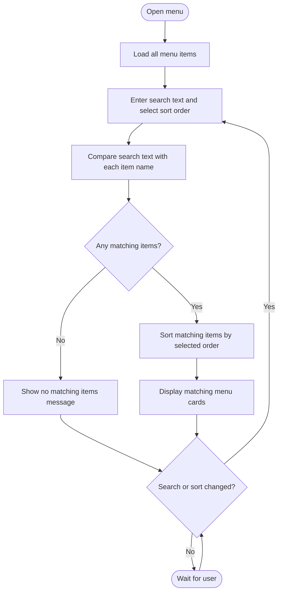

# Food Order App

A simple Python Tkinter restaurant ordering app with a menu, cart, customer details form, and SQLite order saving.

## Run

```bash
cd food_order_app
python main.py
```

## Features

- Menu with food items and prices
- Add items to cart
- Increase or reduce quantity
- Remove items
- Checkout form for customer name, phone number, and delivery address
- Total bill calculation
- Store order in SQLite database
- View order history
- Admin panel to update status and delete orders
- Search menu items by name
- Sort menu items alphabetically or by price

## Menu search and sort flowchart


